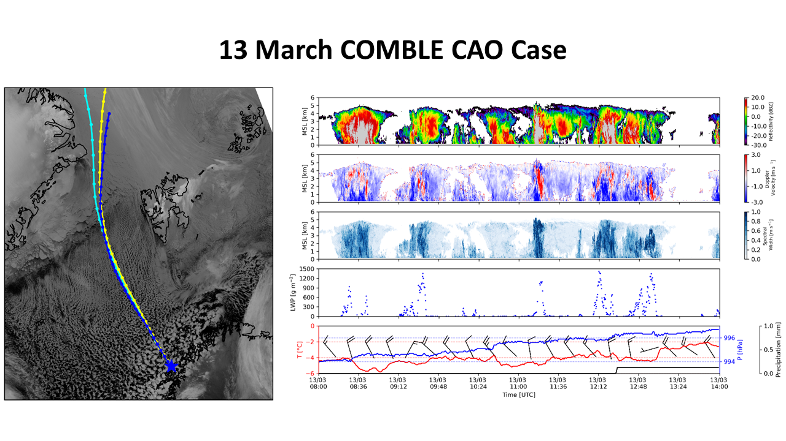

Welcome Page!
===================================

```{note}
This page is under active development.
```

This website is used to host information about the upcoming COMBLE large-eddy simulation (LES) / single-column model (SCM) intercomparison efforts. We welcome you to explore the website to learn more about the intercomparison framework and workflow.



If you are interested in participating in the LES/SCM COMBLE intercomparison, please [sign up here](https://docs.google.com/spreadsheets/d/1h0BDDCCJTfIsdvHHNFyA17bpsNAL7405GG69IkC8qJs/edit?usp=sharing).

Please contact Tim Juliano (NCAR): tjuliano ((at)) ucar.edu OR Florian Tornow (NASA/GISS): ft2544 ((at)) columbia.edu for comments or questions.

## Table of Contents

```{tableofcontents}
```
  
